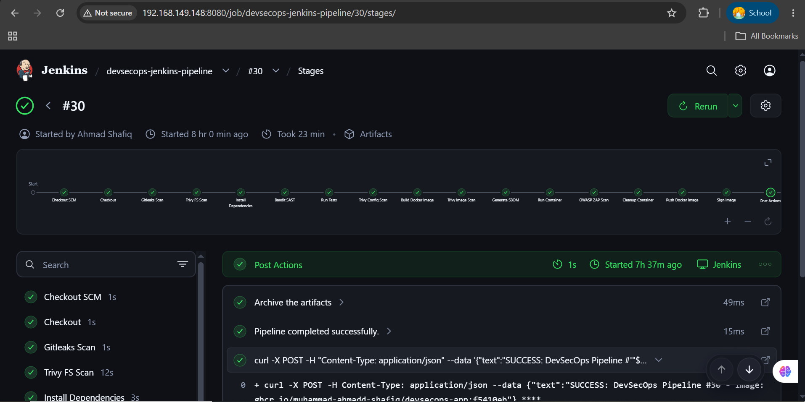
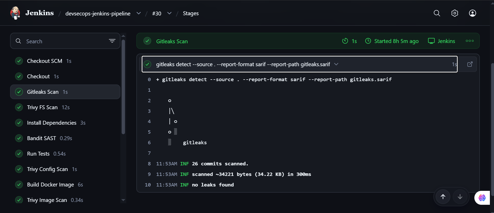
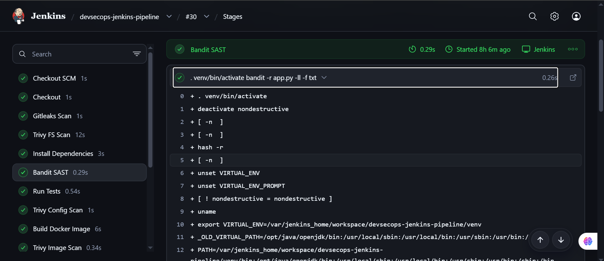
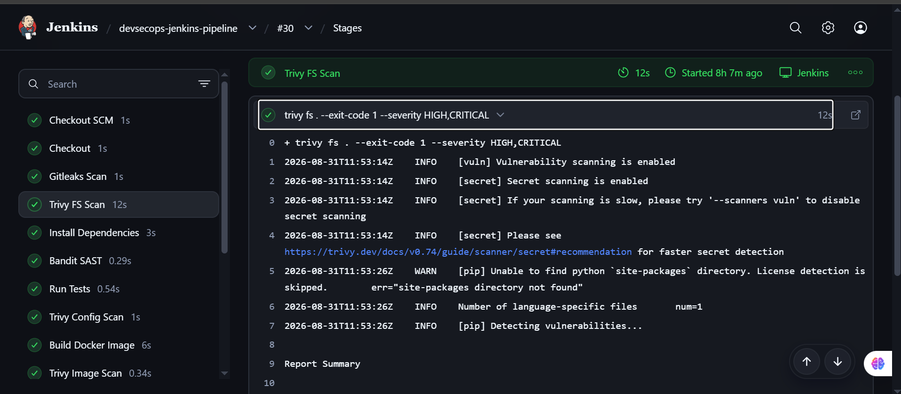
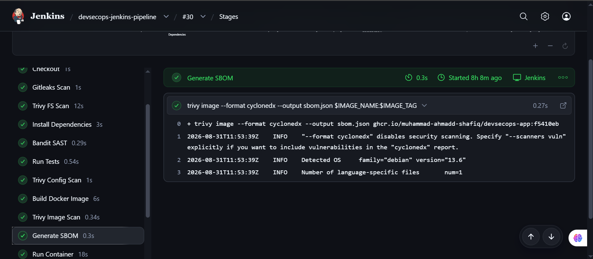
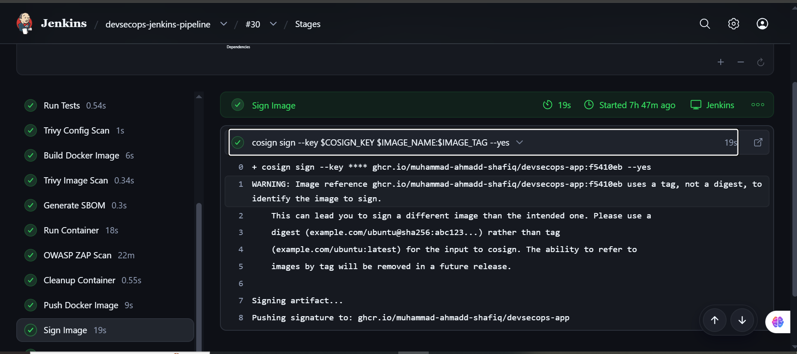
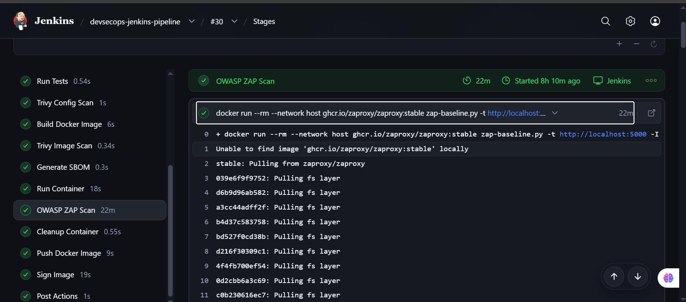
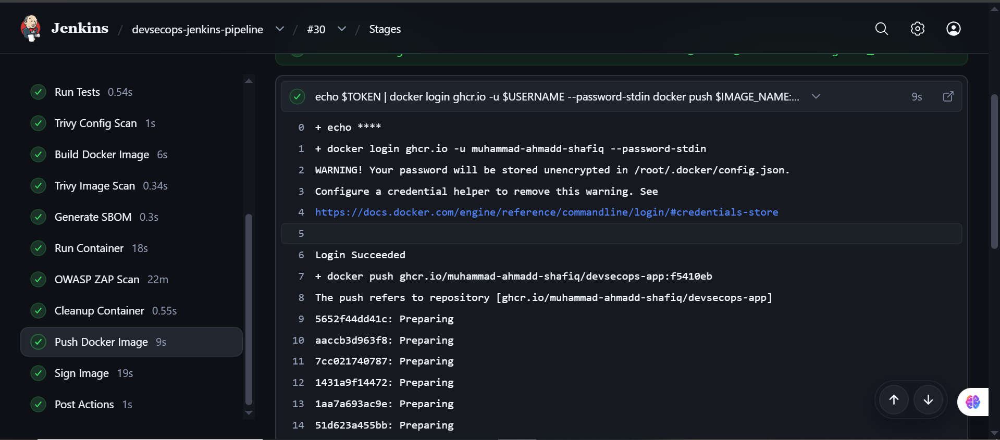
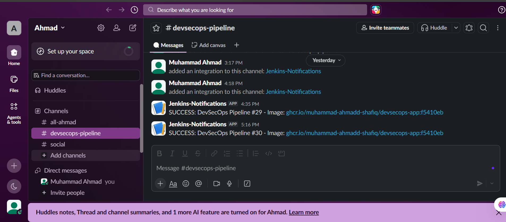
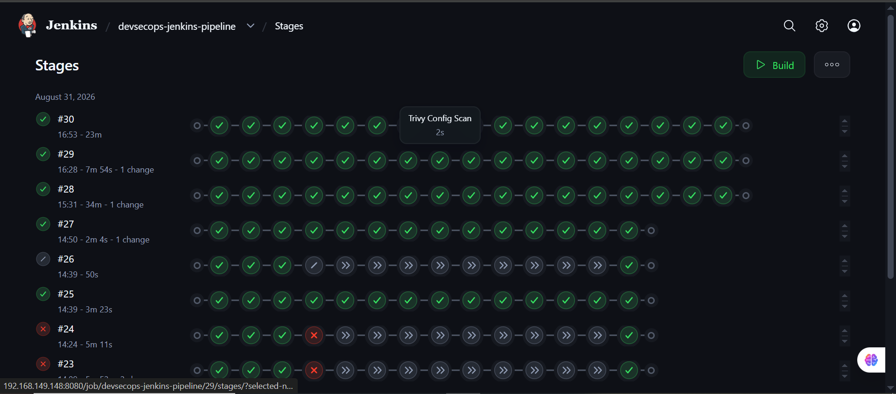

# DevSecOps Security-Gated CI/CD Pipeline

A production-shaped Jenkins CI/CD pipeline for a containerized Flask application, hardened with security gates at every single stage: secret scanning, SAST, SCA, container scanning, SBOM generation, cryptographic image signing, and DAST. This isn't a pipeline that just reports vulnerabilities. Every gate is enforced, meaning a failing check stops the build before an insecure artifact can move any further.

## Why This Exists

Most CI/CD pipelines build, test, and deploy. This one adds an entire security layer on top, treating vulnerabilities, secrets, and misconfigurations as first-class build failures rather than warnings buried in a log. It's a hands-on demonstration of shift-left security and supply-chain integrity, built end-to-end on a self-managed Jenkins instance.

## Pipeline Flow

```
Developer Push
      |
Jenkins (GitHub-triggered)
      |
Gitleaks          -> secret scanning
      |
Bandit            -> SAST
      |
Trivy FS          -> dependency / SCA scan
      |
Trivy Config      -> Dockerfile / IaC misconfig scan
      |
Pytest            -> unit tests
      |
Docker Build
      |
Trivy Image       -> container vulnerability scan
      |
Syft              -> SBOM generation
      |
Cosign            -> image signing
      |
Push to GHCR
      |
Run Container
      |
OWASP ZAP         -> DAST baseline scan
      |
Slack Notification
      |
Deployable, Signed Artifact
```

Any failure at any gate stops the build. Nothing insecure moves further down the pipeline.



## Tech Stack

| Category | Tools |
|---|---|
| CI/CD | Jenkins (Declarative Pipeline) |
| Source Control | Git, GitHub |
| Secret Scanning | Gitleaks |
| SAST | Bandit |
| SCA / Dependency Scanning | Trivy (Filesystem mode) |
| IaC / Config Scanning | Trivy (Config mode) |
| Container Scanning | Trivy (Image mode) |
| SBOM | Syft |
| Image Signing | Cosign |
| DAST | OWASP ZAP |
| Containerization | Docker |
| Registry | GitHub Container Registry (GHCR) |
| Notifications | Slack |
| App | Python / Flask |
| Testing | Pytest |

## What This Pipeline Does

### 1. Continuous Integration

- Automated checkout on every push
- Python virtual environment and dependency installation via `pip`
- Automated build of the Flask application
- Pytest-based unit testing, with the build failing on any test failure

### 2. Security Gates (DevSecOps)

**Secret Scanning: Gitleaks**
Scans the full repository for hardcoded secrets, API keys, and credentials before anything else runs. The pipeline fails immediately if a secret is found, before a single dependency is even installed.



**SAST: Bandit**
Static analysis of the Python source for insecure functions, command injection risks, and other code-level vulnerabilities. A hard gate before the image is ever built.



**SCA: Trivy (Filesystem)**
Scans project dependencies for known CVEs before build time, catching vulnerable open-source packages early rather than after they're baked into an image.

**Infrastructure Misconfiguration: Trivy (Config)**
Scans the Dockerfile and related configuration for misconfigurations and insecure defaults.

**Container Scanning: Trivy (Image)**
Scans the fully built Docker image for OS-level and application-level vulnerabilities. High and critical findings fail the build.



**SBOM Generation: Syft**
Generates a Software Bill of Materials for the built image, giving full dependency inventory and supply-chain visibility. Archived as a build artifact for auditability.



**Image Signing: Cosign**
Cryptographically signs the container image after it clears every scan, enabling downstream signature verification and establishing a trusted software supply chain end to end.



**DAST: OWASP ZAP**
Runs a baseline scan against the live, running container to catch runtime vulnerabilities that static analysis can never see.



### 3. Containerization

- Custom Dockerfile for the Flask app, with OS packages and `pip` patched at build time
- Health checks and image size optimization
- Images pushed to GHCR with build-numbered tags:
  ```
  ghcr.io/muhammad-ahmadd-shafiq/devsecops-app:<tag>
  ```



### 4. Notifications

Jenkins is integrated with Slack to report build status in real time:

```
Build #20 Passed
Build #21 Failed
```

Both pipeline success and security-gate failures trigger alerts, so a broken gate never goes unnoticed.



## Jenkins Administration

- Jenkins deployed via Docker, with Docker socket integration for build agents
- Credentials (GHCR auth, Slack tokens, signing keys) managed through the Jenkins Credentials Store, never hardcoded
- Plugin, job, and workspace management, including build retention and cleanup policies

## Repository Structure

```
.
├── Jenkinsfile          # Declarative pipeline definition: all stages and gates
├── Dockerfile           # Multi-stage, patched, health-checked build
├── docker-compose.yml   # Local orchestration
├── app.py               # Flask application
├── requirements.txt     # Python dependencies
├── tests/                # Pytest test suite
├── .trivyignore          # Documented, justified CVE exceptions
└── .dockerignore
```

## Running Locally

```bash
# Clone
git clone https://github.com/muhammad-ahmadd-shafiq/devsecops-jenkins-pipeline.git
cd devsecops-jenkins-pipeline

# Build and run with Docker
docker build -t devsecops-app .
docker run -p 5000:5000 devsecops-app

# Or via docker-compose
docker-compose up --build
```

To run the full pipeline, point a Jenkins instance (with Docker socket access and the required credentials: GHCR, Slack, and a Cosign key) at this repository and configure a GitHub webhook trigger.

## Full Pipeline Run History



## Skills Demonstrated

- CI/CD pipeline design and automation (Jenkins Declarative Pipeline)
- DevSecOps: shift-left security across secrets, code, dependencies, config, containers, and runtime
- Supply chain security: SBOM generation and cryptographic image signing
- Container security and Docker administration
- Vulnerability management and security gate enforcement
- Linux and Jenkins administration
- Build pipeline troubleshooting and workspace/credential management

## Roadmap

- [ ] Scheduled nightly rebuilds to catch newly disclosed CVEs in unchanged base images
- [ ] Tag promotion and rollback strategy for CD
- [ ] Multi-branch pipeline support

---

*Built as a hands-on DevSecOps portfolio project to demonstrate security-gated CI/CD, supply-chain integrity, and Jenkins pipeline engineering.*
